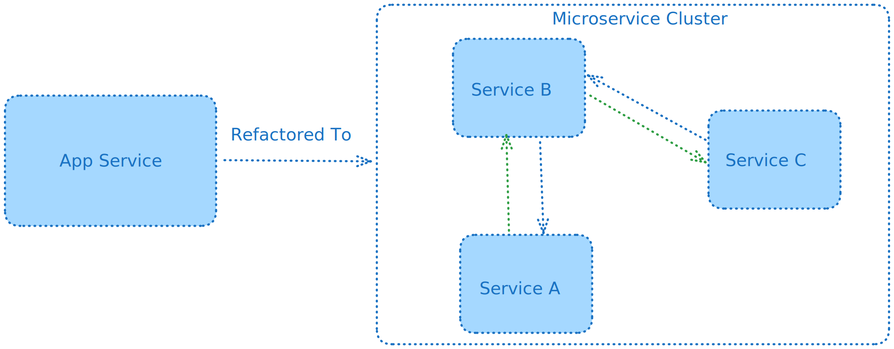

If your team is considering microservices, you should be aware of the challenges associated with them.

Microservices are a great way to scale your application, but they come with a lot of overhead. In this article, I will talk about the challenges and considerations associated with microservices.

## Local Development

Developing and testing a monolith is straightforward as developers can run the entire application on their workstation. However, with a microservices architecture, developers need to run each service individually or together depending on the coupling between the services. This setup increases the complexity of the development environment and can lead to frustration and reduced productivity if not managed properly.

## Testing

Testing a microservices architecture, especially end-to-end or integration testing, requires a more complex setup compared to a monolith. Services may need to be mocked or spun up before tests can be executed. The testing framework needs to account for this complexity, such as waiting for services to be up and running before starting the tests.

## Debugging & Tracing

Tracing requests through multiple services in a microservices architecture requires careful consideration. Without proper tracing in place, debugging issues in production can be challenging. For example, if a client request is handled by service A, which then calls service B, and then service B calls service C, it can be difficult to debug an issue in service C without proper tracing.

## External Services Dependency

Managing dependencies among services can be challenging, especially when different teams are responsible for different services. Services may need to be mocked during testing or development. Additionally, deploying microservices requires deploying each service individually, which can be time-consuming and complex to set up and debug.

## Versioning & Dependency

Proper API versioning is crucial for managing dependencies between services. If service A depends on service B, any changes in service B may require updating and deploying service A. Deciding which service to deploy first can be tricky. If service A is deployed first, service B may be broken until service B is deployed. If service B is deployed first, service A may be broken until service A is deployed. Services should strive to be backwards compatible if versioning is not in place.

## Deployment

Coordinating service deployments and managing multiple services require careful planning. Deployment pipelines need to be designed to handle multiple services efficiently and minimize duplication.

## Conclusion

While microservices offer scalability benefits, they also come with significant challenges. Designing the architecture with careful consideration can help mitigate the pitfalls mentioned above.

This article is not meant to discourage you from using microservices. Instead, it is meant to help you understand the challenges associated with microservices so that you can make an informed decision about whether or not they are right for your team.
